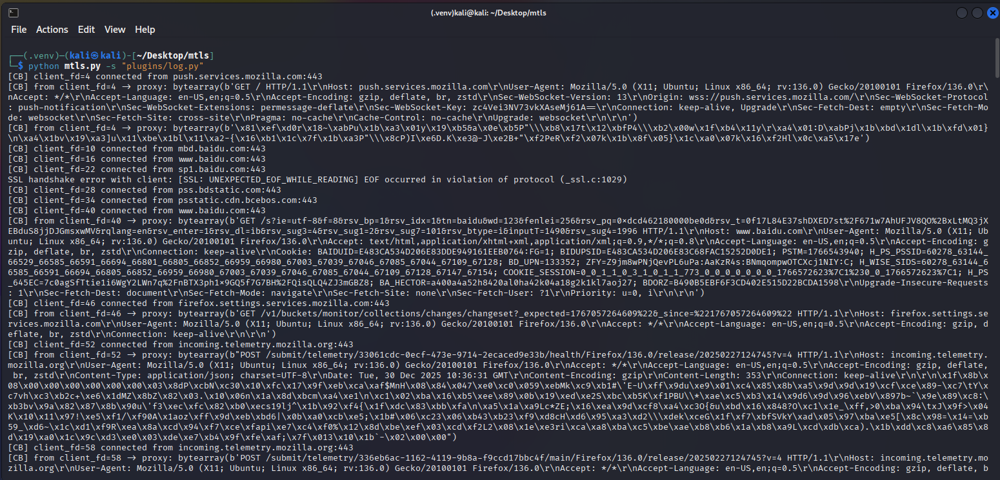
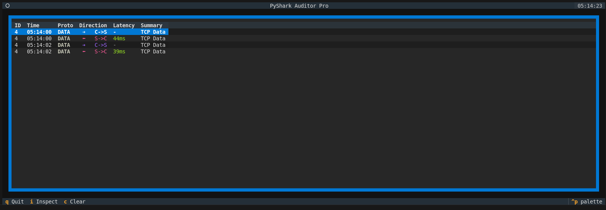
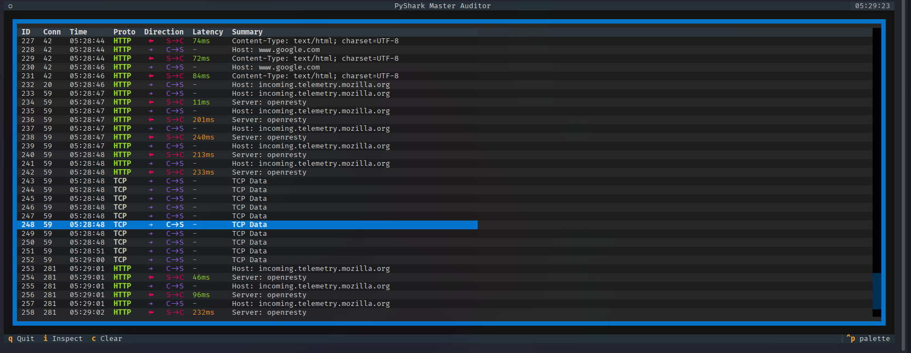
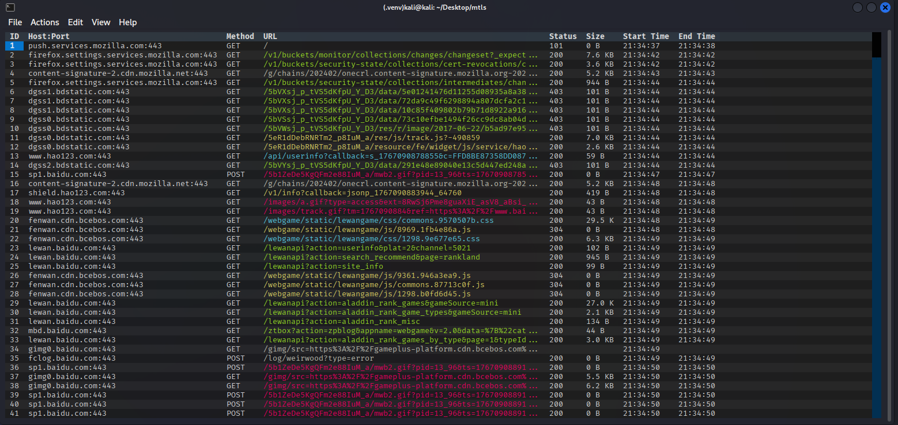

# Tls中间人劫持

支持TCP流量的TLS中间人攻击，在网关上游配置路由实现tls流量解密，无需客户端配置（当然证书还是要安装或者patch的），将TLS流量中的加密内容提取实现修改和查看。

通过插件的方式实现功能扩展，目前提供的插件有：
- 打印日志

- 解析协议



- 查看http请求


# 环境配置

## 生成证书

```bash
./generate_certs.sh
```

此处将会生成根证书到 `certs/ca-cert.pem`，请将其安装到客户端。

## 配置网关

```bash
sudo sysctl -w net.ipv4.ip_forward=1
sudo iptables -t nat -A POSTROUTING -o eth0 -j MASQUERADE
sudo iptables -A FORWARD -i eth1 -o eth0 -j ACCEPT
sudo iptables -A FORWARD -i eth0 -o eth1 -m state --state RELATED,ESTABLISHED -j ACCEPT
```

> 注意：此处eth0为wan口，eth1为lan口，请根据实际情况修改。

## 配置iptables

```bash
iptables -t nat -A PREROUTING -p tcp --dport 443 -j REDIRECT --to-port 443
```
## 安装依赖

```bash
python -m venv venv
source venv/bin/activate
pip install -r requirements.txt
```

# 运行示例

## 运行 tls 中间人劫持

参数说明：

```bash

usage: mtls.py [-h] -s CALLBACK_SCRIPT_PATH [--listen-port LISTEN_PORT] [--cert-file CERT_FILE] [--key-file KEY_FILE] [--tmp-pem-dir TMP_PEM_DIR] [--timeout TIMEOUT] [--upstream UPSTREAM]

SSL proxy with pluggable callback script

options:
  -h, --help            show this help message and exit
  -s, --script CALLBACK_SCRIPT_PATH
                        Path to the callback script, e.g. ./logging_callback.py
  --listen-port LISTEN_PORT
                        Listen port (default: 443)
  --cert-file CERT_FILE
                        Path to server certificate file (default: certs/ca-cert.pem)
  --key-file KEY_FILE   Path to server private key file (default: certs/ca-key.pem)
  --tmp-pem-dir TMP_PEM_DIR
                        Directory to store generated leaf certificate/key PEM files (default: ./tmp). WARNING: this directory may be cleared on startup.
  --timeout TIMEOUT     Timeout for SSL connections Set to -1 to disable timeout.
  --upstream UPSTREAM   Optional fixed upstream address in the form host:port. If omitted, the proxy will use the original target host and port.

```

## 使用示例

指定需要执行的插件，项目中携带了三个示例插件
1. `log.py`
2. `http.py`( `http.py` 依赖了 `http_ex.py` 提供界面显示，目前没有支持http2.0以及ws)，可以根据需要自行编写插件。
3. `shark.py` 解析协议 (目前支持常见的一些协议)

```bash
# 打印日志
python mtls.py -s plugins/log.py
# 解析协议
python mtls.py -s plugins/shark.py
# 查看http请求
python mtls.py -s plugins/http.py

```

## 测试示例

查看example文件夹。